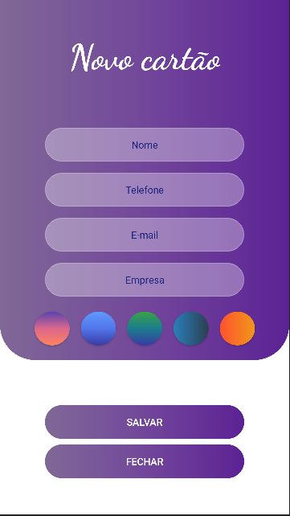

# Business Card
App desenvolvido no módulo Criando um app de cartão de visitas em Kotlin do bootcamp Inter Android Developer na Digital Innovation One, instrutor Igor Rotondo Baglioti.

****
## Screenshots

****

🧡 Inter Android Developer bootcamp 2021
